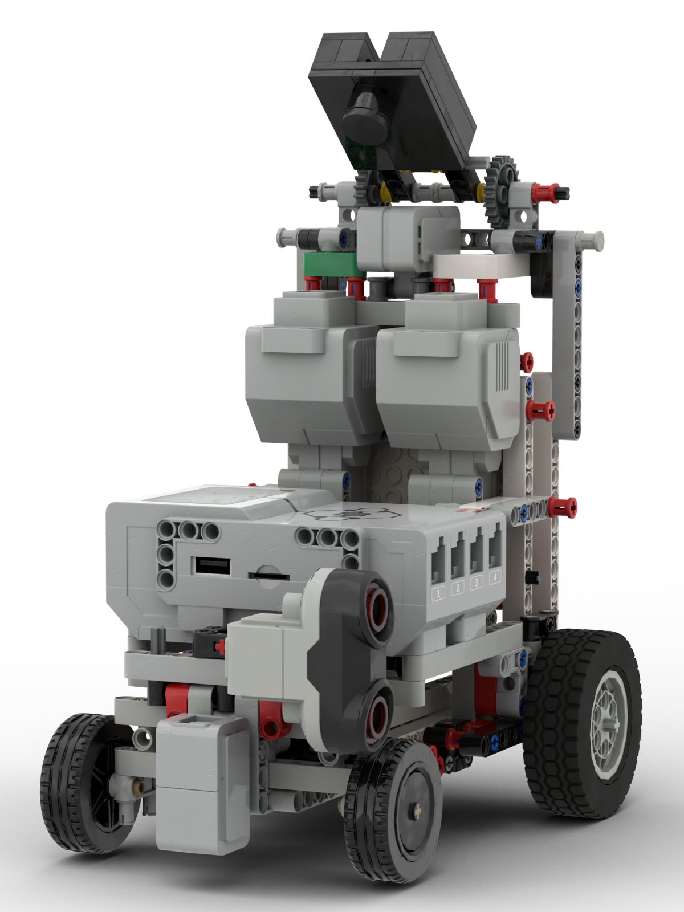
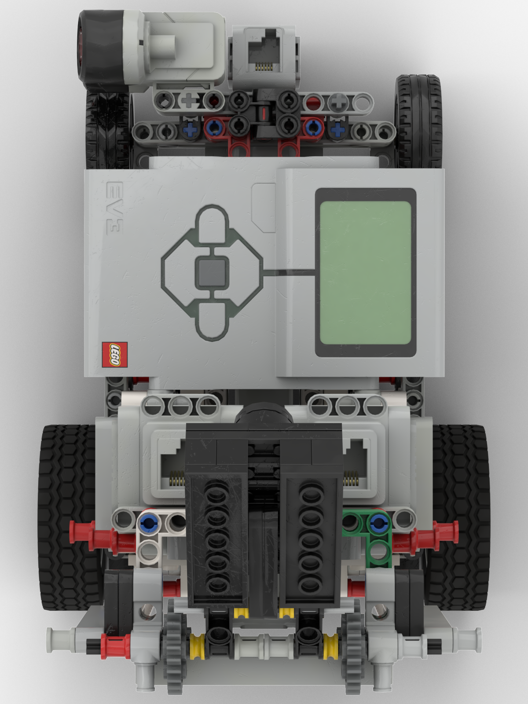
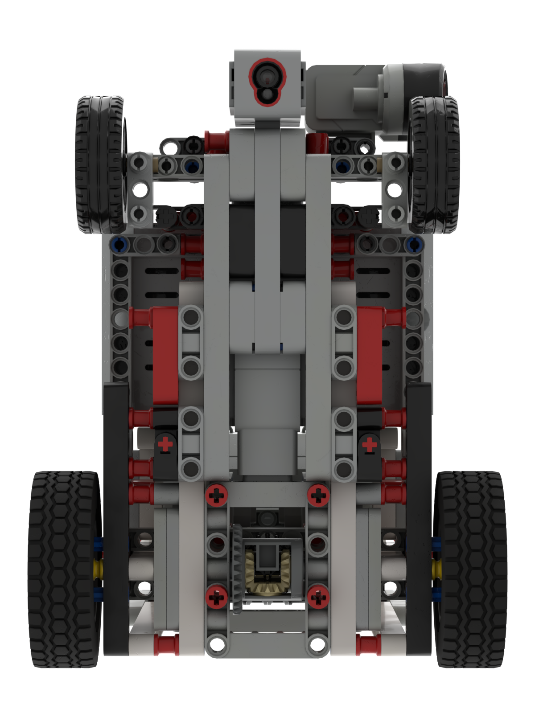
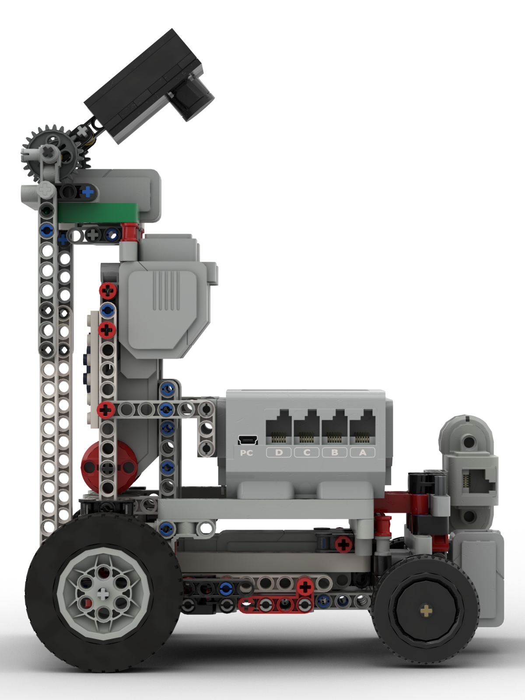

**Robotek PRIME team's repository for WRO Future Engineers 2024.**

 

***

# Contents

* [**Mobility management**](#mobility-management)
  * [Motor selection](#motor-selection)
  * [Chassis design](#chassis-design)
* [**Power and sense management**](#power-and-sense-management)
  * [Sensor management](#sensor-management)
  * [Power management](#power-management)
* [**Engineering factor**](#engineering-factor)
* [**Obstacle management**](#obstacle-management)
  * [Program](#program)
* [**Pictures**](#pictures)
  * [Team photos](#team-photos)
  * [Robot photos](#robot-photos)
* [**Performance video**](#performance-video)

***

# Mobility Management

## Motor selection

Comparison of motors:

The large motor runs at 160-170 rpm, with a running torque of 20 Ncm and a stall torque of 40 Ncm (slower, but stronger).

The medium motor runs at 240-250 rpm, with a running torque of 8 Ncm and a stall torque of 12 Ncm (faster, but less powerful).
We use a medium motor for steering and two large motors in the back for driving. The medium motor is lighter and is sufficient for steering, while the larger motors have more power, which helps them be the main driving force of the robot.

## Chassis design

We placed the middle motor for the rudder horizontally, trying to create an ackerman angle, but eventually abandoned this idea. With the help of gears, we increase the number of revolutions of the rear motors by 19% (20/12*20/28). Wheels with a diameter of 62.4 mm also help to increase speed. The speed of our robot is 6.4 m/s (165*20/12*20/28*pi*62.4/100/60). Our robot is rear-wheel drive. This greatly simplifies the design and improves maintainability. We have a differential on the rear axle, which helps reduce the turning radius. 3D models of the robot made in BrickLink Studio 2.0 and SolidWorks are located in the [Models](https://github.com/RobotekPRIME2024/WRO-FE24/tree/main/Models) folder.

***

# Power and sense management

## Power management

The power for the EV3 Brick and the whole vehicle comes from a rechargeable 10V Lithium Battery. It (with a brick) is placed closer to the front axle than to the rear to ensure good traction of the front wheels when cornering.
Links to power schemes for each electronic part:

[EV3 P-Brick](https://github.com/RobotekPRIME2024/WRO-FE24/blob/main/Schemes/95646c01%20Programmable%20brick.pdf)

[Battery](https://github.com/RobotekPRIME2024/WRO-FE24/blob/main/Schemes/95656%20Rechargeable%20battery.pdf)

[Large motor](https://github.com/RobotekPRIME2024/WRO-FE24/blob/main/Schemes/95658%20Large%20motor.pdf)

[Medium motor](https://github.com/RobotekPRIME2024/WRO-FE24/blob/main/Schemes/99455%20Medium%20motor.pdf)

[Color Sensor](https://github.com/RobotekPRIME2024/WRO-FE24/blob/main/Schemes/95650%20Color%20sensor.pdf)

[Ultrasonic Sensor](schemes/ultrasonic-sensor.pdf)

[Gyro Sensor](https://github.com/RobotekPRIME2024/WRO-FE24/blob/main/Schemes/99380%20Gyro%20sensor.pdf)

[Pixy2](https://github.com/RobotekPRIME2024/WRO-FE24/blob/main/Schemes/Pixy2.pdf)

## Sensor management

We use a color sensor to detect and determine the color of lines, a gyroscope to determine the angle of the robot, one ultrasonic sensor in the “obstacle” (clockwise or counterclockwise) or two in the “open” to determine the distance between the robot and the wall. We also use the Pixie Camera to detect and determine the color of road signs. To determine the most accurate distance of the robot from the border, we conducted a research, which you can find in the [Researches](https://github.com/RobotekPRIME2024/WRO-FE24/tree/main/Researches/5-8.5(angle-error%20of%20ultrasonic)). The ultrasonic sensor shows incorrect data if it is located at an angle. On April 8, we made a graph of error versus angle.

***

# Engineering factor

We used components from the MINDSTORMS EV3 Core Set, a Pixy2 camera and some other technic pieces from other sets.

***

# Obstacle management

## Program

The final program for the robot and pseudocode are located in the [Source](https://github.com/RobotekPRIME2024/WRO-FE24/tree/main/Source)

***

# Pictures
## Team photos

## Robot photos

# Performance video
