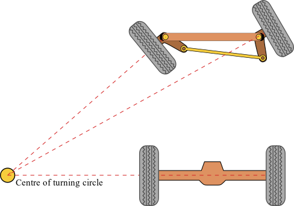
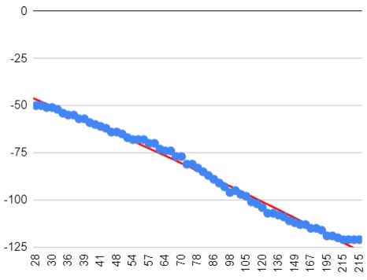
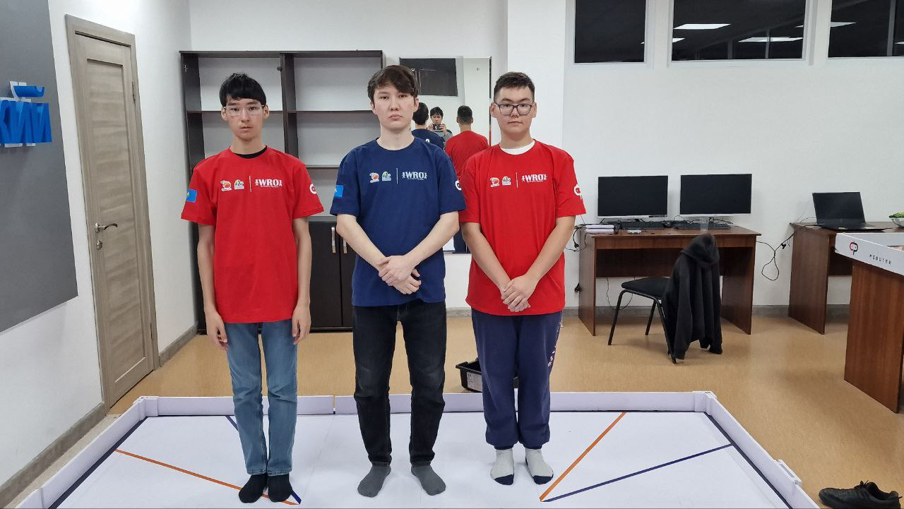
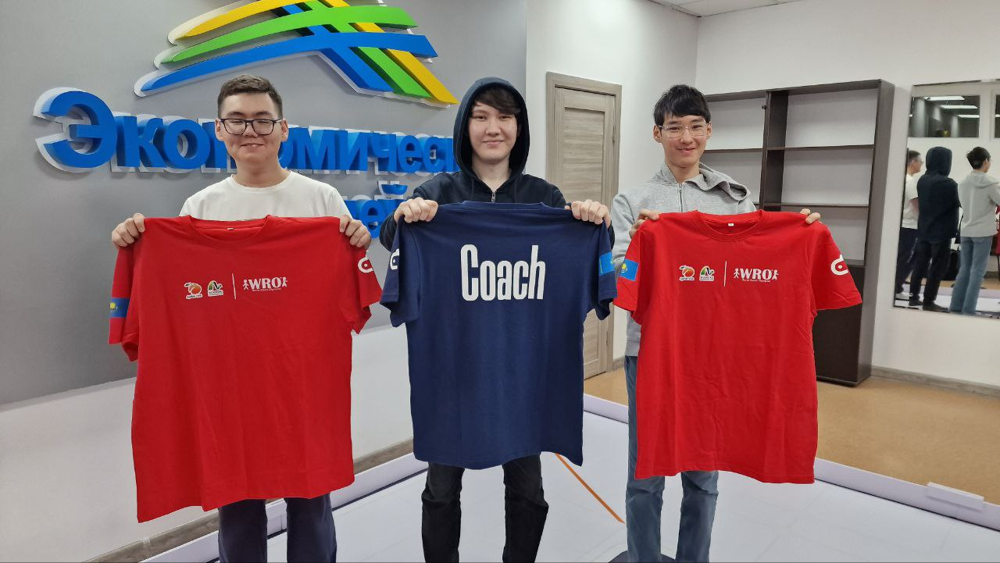
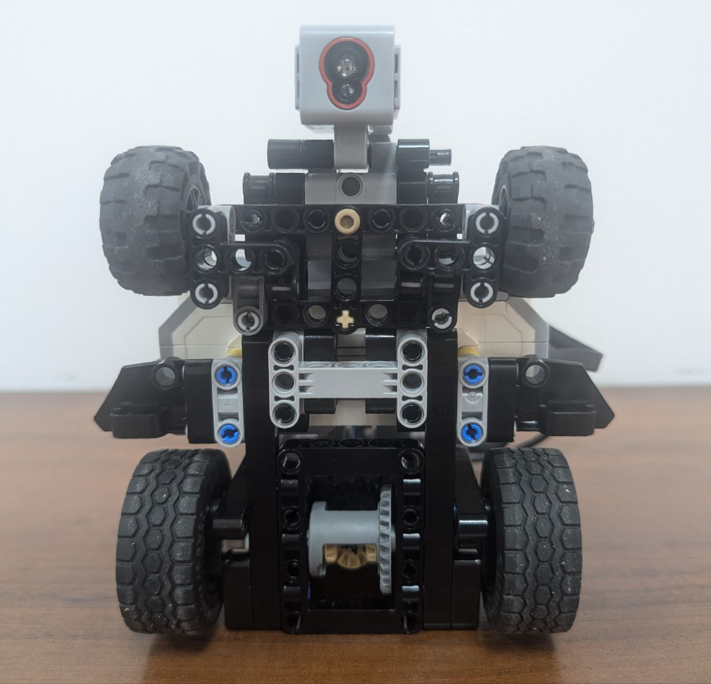
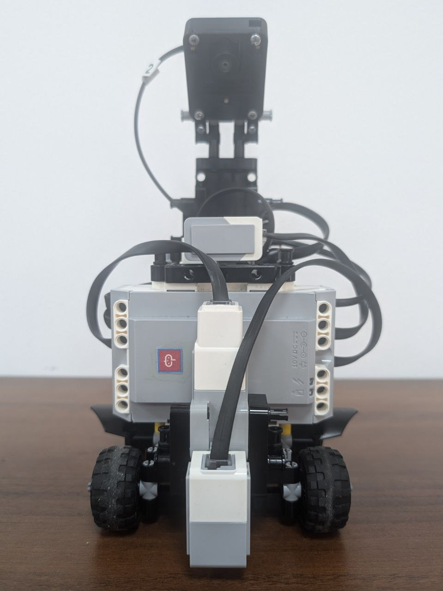
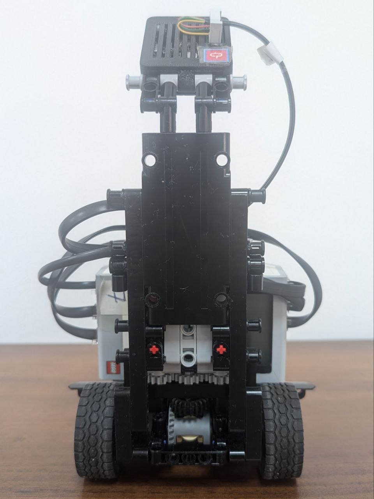
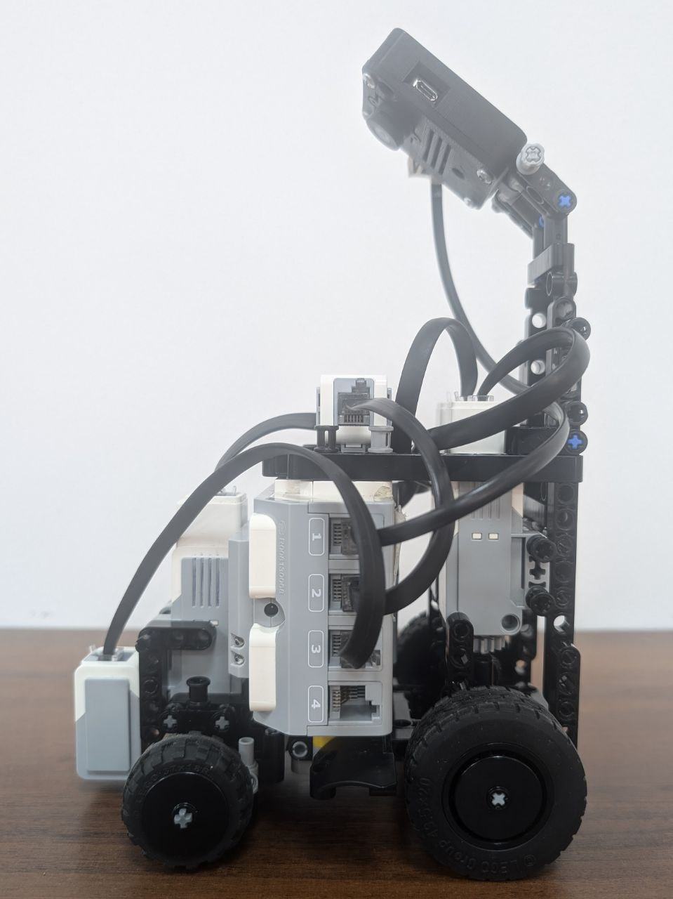
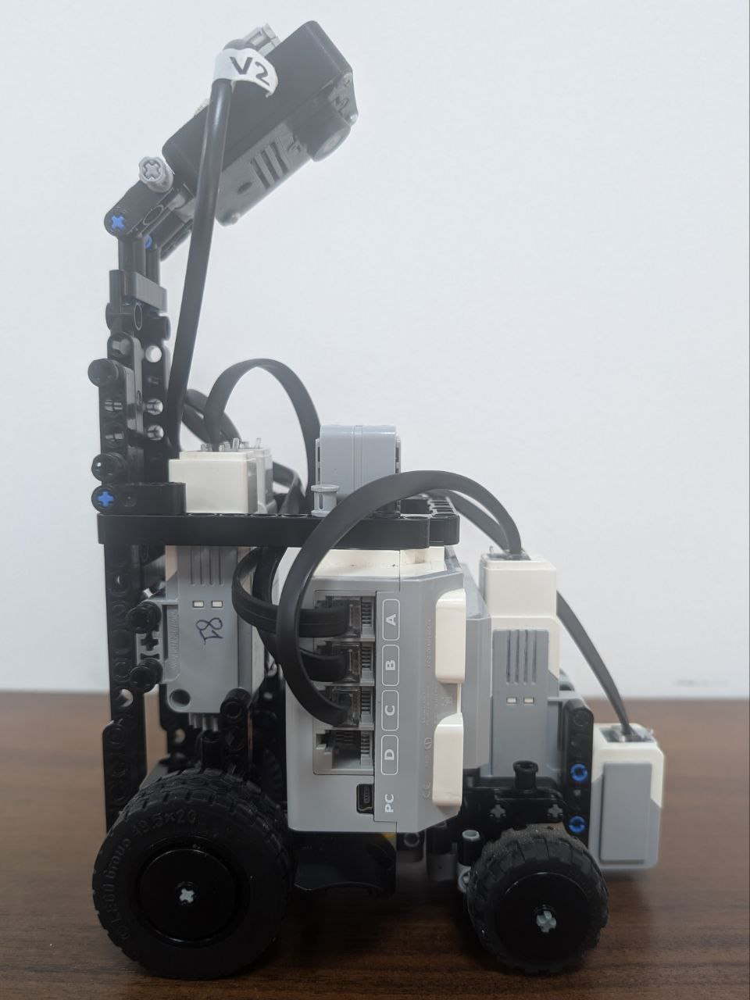

 Robotek PRIME team's repository for WRO Future Engineers 2024
 
 Members: Dastan Musrepov, Vagis Disembayev

 

***

# Contents

* [Mobility management](#mobility-management)
  * [Motor selection](#motor-selection)
  * [Chassis design](#chassis-design)
    * [Models](https://github.com/RobotekPRIME2024/WRO-FE24/tree/main/Models)
    * [Instruction](https://github.com/RobotekPRIME2024/WRO-FE24/tree/main/Instruction.pdf)
* [Power and sense management](#power-and-sense-management)
  * [Power management](#power-management)
    * [Schemes](https://github.com/RobotekPRIME2024/WRO-FE24/tree/main/Schemes)
  * [Sensor management](#sensor-management)
    * [Ultrasonic research](https://github.com/RobotekPRIME2024/WRO-FE24/blob/main/Ultrasonic_research/README.md) 
* [Engineering factor](#engineering-factor)
* [Obstacle management](#obstacle-management)
  * [Program and pseudocode](https://github.com/RobotekPRIME2024/WRO-FE24/tree/main/Source)
* [Pictures](#pictures)
  * [Team photos](#team-photos)
  * [Robot photos](#robot-photos)
* [Performance video](#performance-video)
  * [Qualification](https://youtu.be/wz5MyXlZ5nA)
  * [Obstacle](https://youtu.be/)

***

# Mobility Management

## Motor selection

Comparison of motors:
The large motor runs at 160-170 rpm, with a running torque of 20 Ncm and a stall torque of 40 Ncm (slower, but stronger).
The medium motor runs at 240-250 rpm, with a running torque of 8 Ncm and a stall torque of 12 Ncm (faster, but less powerful).
We use a medium motor for steering and two medium motors in the back for driving. We use medium motors because they are lighter, faster and have enough torque.
<!The medium motor is lighter and is sufficient for steering, while the larger motors have more power, which helps them be the main driving force of the robot.>

## Chassis design

 

We placed the steering motor horizontally to save space and make an 4 linkage approximation of Ackerman angle ([photo above](https://github.com/RobotekPRIME2024/WRO-FE24/tree/main/Images/Ackermann_steering_geometry.png)). The steering motor works without gears for increased speed and precision. The width of our robot is 16 cm and the length of our robot is 15.9 cm, which allows us to park perpendicularly. Gears on the rear motors are 1:1 (excluding differential) and diameter of the wheels is 43.2 mm, all this increases the accuracy of odometry. The maximum speed of our robot is 14.7 cm/s. Our robot is rear-wheel drive. This greatly simplifies the design and improves maintainability. We have a differential on the rear axle, which helps reduce the turning radius. By using Ackermann steering geometry, we increase the accuracy of odometry, prevent wheel spin, and reduce the turning radius. The real Ackermann 5 linkage steering geometry and it's differnces from the 4 linkage approximation are described in the [Design of an Ackermann-type steering mechanism](https://www.researchgate.net/publication/265755401_Design_of_an_Ackermann_Type_Steering_Mechanism). But the real 5 linkage Ackermann steering geometry can't be made from Lego. We used black parts when building the robot to make it look stylish and similar to the Batmobile. 3D models of the robot made in BrickLink Studio 2.0 and Pixy2 mount are located in the [Models](https://github.com/RobotekPRIME2024/WRO-FE24/tree/main/Models) folder. Building instructions located in the [Instruction](https://github.com/RobotekPRIME2024/WRO-FE24/tree/main/Instruction.pdf) file.

***

# Power and sense management

## Power management

The power for the EV3 Brick and the whole vehicle comes from a rechargeable 10V Lithium Battery. It (with a brick) is placed closer to the front axle than to the rear to ensure good traction of the front wheels when cornering. Schemes for each electronic part of the robot can be found [here](https://github.com/RobotekPRIME2024/WRO-FE24/tree/main/Scheme.pdf).

## Sensor management

We use a color sensor to detect and determine the color of lines, a gyroscope to determine the angle of the robot, ultrasonic sensor to determine the distance between from the robot to the wall, thereby updating the odometry on turns - when seeing a line. We also use the Pixy2 to detect and determine the color of road signs on the first 'obstacle' lap. To determine the most accurate distance of the robot from the border, we conducted a research, which you can find in the [Researches](https://github.com/RobotekPRIME2024/WRO-FE24/tree/main/Ultrasonic_research). The ultrasonic sensor shows incorrect data if it is located at an angle. On April 8, we made a graph of error versus angle.

***

# Engineering factor

We used components from the MINDSTORMS EV3 Core Set, a Pixy2, some other technic pieces from other sets and 3D printed [Pixy case](https://github.com/RobotekPRIME2024/WRO-FE24/tree/main/Models/Pixy2Case).

***

# Obstacle management

First you need to configure PixyCam 2.1 to detect green and red road signs. Then you need to find the trajectory of the road sign using the Pixy2. To do this, we launch the robot so that it goes around the road sign and records its coordinates using the Pixy2. He takes the center of the road sign as the coordinates. After that, we transfer the data into a table and use the built-in tools in Google Sheets to find the equation. The robot tries to adhere to this trajectory. If the object is red, then x of function are multiplied by 1, and if the object is green, then x of function are multiplied by -1 (inverse function).

Compared to the robot from the regional stage, we only drive with the held of the Pixy2 on the first lap, during which we record the coordinates of the points along which it will drive to avoid road signs on the remaining laps. We use local ododmetry to determine the position of the robot. To calculate the robot's x, we multiply the distance traveled by the cosine of the robot's angle, and to calculate the robot's y we multiply the distance traveled by the sine of the robot's angle. We calculate the distance traveled by multiplying the encoder angle by a coefficient equal to 33 dergrees to cm. We reset robot's odometry on turns, without using ultrasonic.

The final robot program with pseudocode is located in the [Source](https://github.com/RobotekPRIME2024/WRO-FE24/tree/main/Source).

***

# Pictures
## Team photos

## Robot photos

# Performance video

Here is the link to [qualification](https://youtu.be/wz5MyXlZ5nA) and [obstacle](https://youtu.be/) round demostration.
